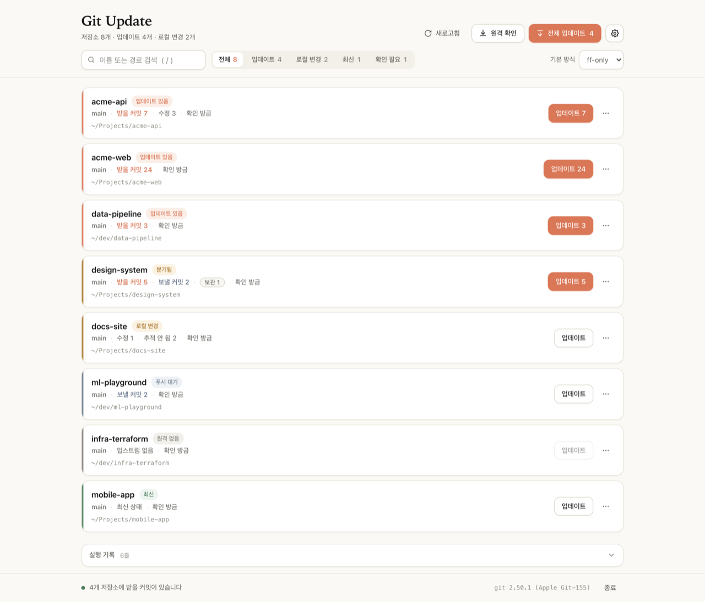
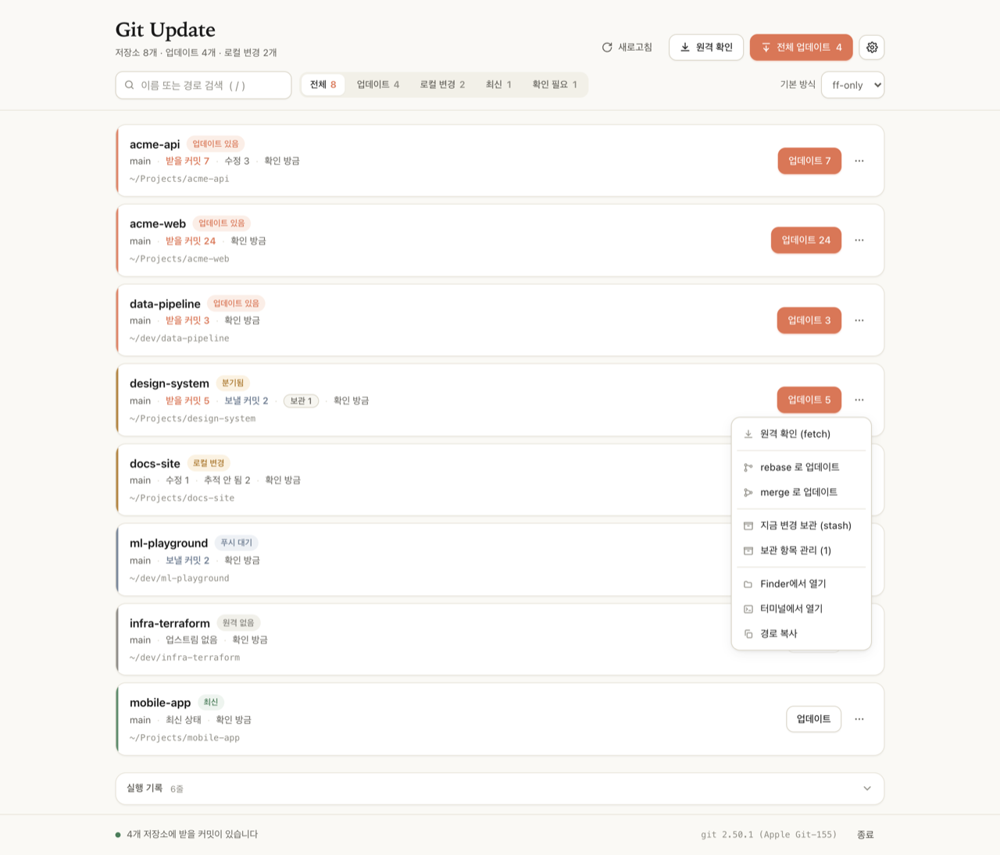
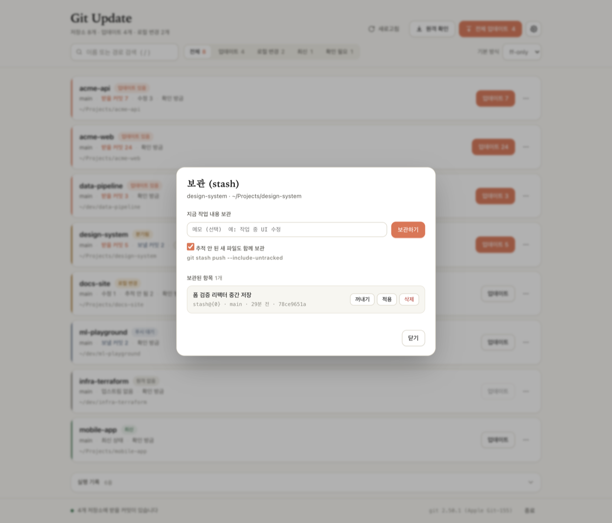
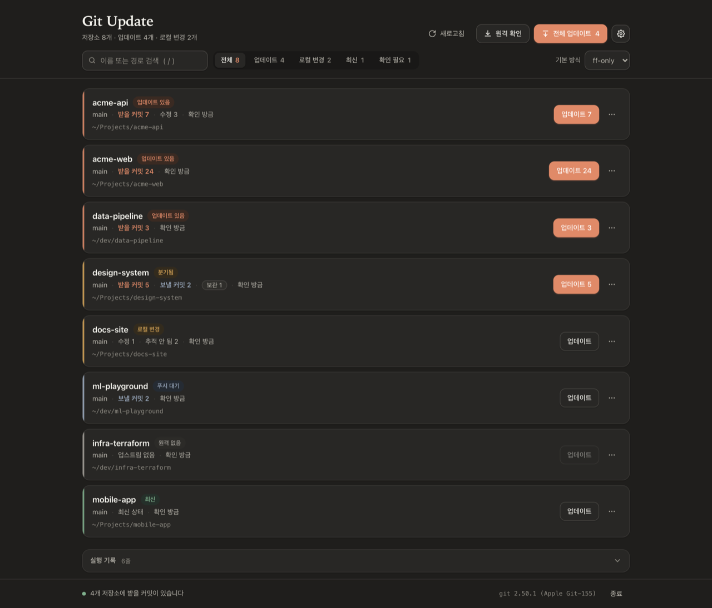

# Git Update

로컬에 흩어져 있는 git 저장소를 한 화면에 모아, **버튼 하나로 최신 상태로 만드는 가벼운 GUI**입니다.
저장소마다 `cd` 하고 `git pull` 치는 일을 줄이려고 만들었습니다.


-3776ab)


- 설치할 패키지가 **하나도 없습니다.** macOS 기본 `python3` 표준 라이브러리와 `git` 만 씁니다.
- 화면은 브라우저 창, 로직은 로컬 파이썬 프로세스입니다. 서버는 `127.0.0.1` 에만 열리고 실행할 때마다 새 토큰을 요구합니다.
- `pull` 뿐 아니라 **rebase / merge / stash** 까지 클릭으로 처리합니다.

---

## 한 줄로 실행

```bash
npx github:info-sum/git-update
```

받아서 바로 실행합니다. 설치 없이 매번 최신 코드로 쓰고 싶을 때 이걸 쓰면 됩니다.

계속 쓸 거라면 설치해 두는 쪽이 빠릅니다.

```bash
curl -fsSL https://raw.githubusercontent.com/info-sum/git-update/main/install.sh | sh
```

`~/.gitupdate` 에 받아두고 `~/.local/bin/gitupdate` 명령을 만들어 줍니다. 다시 실행하면 최신으로 갱신됩니다.
설치 후에는 이렇게 씁니다.

```bash
gitupdate           # 브라우저 창으로 GUI 실행
gitupdate --list    # 화면 없이 터미널에 저장소 상태만 출력
```

직접 클론해서 쓰려면:

```bash
git clone https://github.com/info-sum/git-update.git
cd git-update && python3 main.py
```

Finder 에서 **`GitUpdate.command` 더블클릭**으로도 실행됩니다. Dock 에 두고 쓰기 편합니다.

---

## 화면

저장소 목록. 손이 필요한 것이 위로 올라옵니다 (업데이트 → 분기 → 오류 → 로컬 변경 → 푸시 대기 → 최신).



`⋯` 메뉴. 저장소별로 rebase / merge / 보관을 바로 실행합니다.



보관(stash) 창. 메모를 달아 보관하고, 항목별로 꺼내기 · 적용 · 삭제를 고릅니다.



시스템 설정을 따라 다크 모드로 전환됩니다.



> 스크린샷의 저장소 이름과 경로는 데모용입니다.

---

## 기능

| 기능 | 설명 |
| --- | --- |
| 자동 수집 | 지정한 폴더를 훑어 git 저장소를 찾습니다. 저장소 내부로는 더 내려가지 않아 하위 모듈이 중복으로 잡히지 않습니다. |
| 상태 표시 | 브랜치, 받을/보낼 커밋 수, 수정·추적 안 된 파일 수, 보관 개수, 마지막 원격 확인 시각 |
| 업데이트 | 행의 `업데이트` 버튼 = `git pull`. fetch 가 포함되므로 한 번 누르면 최신이 됩니다. |
| rebase / merge | `⋯` 메뉴에서 저장소별로 바로 실행. 기본 방식과 무관하게 그때그때 고를 수 있습니다. |
| 보관 (stash) | 작업 내용 보관, 목록 확인, 꺼내기(pop) / 적용(apply) / 삭제(drop) |
| 전체 업데이트 | 받을 커밋이 있는 저장소를 한 번에. 대상 목록을 먼저 확인창으로 보여줍니다. |
| 실패 안내 | git 오류를 한국어로 풀어주고, 다음 수단 버튼(rebase / merge / 보관하고 다시 시도)을 바로 띄웁니다. |
| 검색 / 필터 | 이름·경로 검색, 상태별 필터 |
| 실행 기록 | git 원본 출력을 그대로 남겨 무슨 일이 있었는지 확인 가능 |
| 바로 열기 | `⋯` 메뉴에서 Finder / 터미널 열기, 경로 복사 |

### 상태 배지

| 배지 | 뜻 | 색 |
| --- | --- | --- |
| `업데이트 있음` | 받을 커밋이 있음 | 코랄 |
| `분기됨` | 받을 커밋 + 보낼 커밋 동시 존재. `ff-only` 로는 합칠 수 없어 rebase / merge 가 필요 | 앰버 |
| `로컬 변경` | 커밋되지 않은 수정이나 추적 안 된 파일이 있음 | 앰버 |
| `푸시 대기` | 보낼 커밋만 있음 | 슬레이트 |
| `최신` | 원격과 같고 작업 트리도 깨끗함 | 그린 |
| `원격 없음` / `HEAD 분리` | 받을 대상이 없어 업데이트 버튼이 잠김 | 회색 |
| `오류` | 상태를 읽지 못함 | 레드 |

---

## 업데이트 방식

| 방식 | 실제 명령 | 성격 |
| --- | --- | --- |
| `ff-only` (기본) | `git pull --ff-only --autostash` | 빨리 감기만 허용. 로컬 커밋이 있으면 **아무것도 하지 않고 중단**합니다. 가장 안전합니다. |
| `rebase` | `git pull --rebase --autostash` | 원격 커밋 위로 내 커밋을 다시 쌓습니다. 이력이 한 줄로 남습니다. |
| `merge` | `git pull --no-rebase --no-edit --autostash` | 병합 커밋을 만들어 합칩니다. |

상단 오른쪽 **기본 방식**은 `업데이트` 버튼과 `전체 업데이트`가 쓰는 값이고, 저장소별로는 `⋯` 메뉴에서 그때그때 rebase / merge 를 실행할 수 있습니다.
`ff-only` 로 막히면 결과 안내에 **rebase / merge 로 다시 시도** 버튼이 붙습니다.

`--autostash` 는 설정에서 끌 수 있습니다. 켜져 있으면 업데이트 전에 로컬 변경을 자동으로 보관하고 끝나면 되돌려 놓습니다.
되돌리는 과정에서 충돌이 나면 `확인 필요` 로 표시하고 **보관 항목을 지우지 않습니다.**

---

## 보관 (stash)

`⋯` 메뉴 → `지금 변경 보관` 은 추적 안 된 파일까지 한 번에 보관합니다 (`git stash push --include-untracked`).

행의 `보관 N` 칩이나 `보관 항목 관리` 를 누르면 보관 창이 열립니다.

- 메모를 달아 새로 보관 / 추적 안 된 파일 포함 여부 선택
- 항목별로 `stash@{0} · 브랜치 · 시각 · 해시` 확인
- **꺼내기**(`pop`, 목록에서 제거) / **적용**(`apply`, 목록 유지) / **삭제**(`drop`)
- 삭제는 되돌리기 어려우므로 확인창을 띄웁니다
- `pop` 이 충돌하면 보관 항목을 남겨둔 채 안내만 합니다

로컬 변경 때문에 업데이트가 막힌 경우엔 **보관하고 다시 시도** 버튼 한 번으로 `stash push` → `pull` 이 이어집니다.

---

## 단축키

| 키 | 동작 |
| --- | --- |
| `/` | 검색창 포커스 |
| `R` | 다시 검색 (네트워크 없음) |
| `F` | 모든 저장소 원격 확인 (fetch) |
| `,` | 설정 열기 |
| `Esc` | 창·메뉴 닫기 |

---

## 설정

`설정` 버튼에서 바꿉니다. 값은 `~/.config/gitupdate/config.json` 에 저장됩니다.

| 항목 | 기본값 | 설명 |
| --- | --- | --- |
| 검색할 폴더 | `~/Documents/project`, `~/Projects`, `~/src` 등 **실제로 있는 것만** | macOS 기본 폴더 선택창으로 추가하거나 경로를 직접 입력 |
| 하위 탐색 깊이 | `4` | 루트 기준 몇 단계까지 내려갈지 |
| 제외 폴더 | `node_modules`, `.venv`, `build`, `Library` 등 | 스캔에서 건너뛸 폴더 이름 |
| 업데이트 방식 | `ff-only` | 위 표 참고 |
| 자동 보관 | 켜짐 | `--autostash` |
| 시작할 때 원격 확인 | 켜짐 | 정확한 "받을 커밋" 수를 바로 보여줍니다. 저장소가 많으면 몇 초 걸립니다. |

다른 설정 파일을 쓰려면 `GITUPDATE_CONFIG_DIR=/path/to/dir gitupdate` 로 실행하면 됩니다.

---

## 보안

`git pull` 을 실행하는 로컬 서버이므로 다음을 막아 뒀습니다.

- `127.0.0.1` 에만 바인딩 (외부 접근 불가), 포트는 빈 포트를 자동 선택
- 실행할 때마다 만드는 랜덤 토큰을 **모든 요청**에서 확인 (`X-Token` 헤더 또는 최초 URL)
- `Host` / `Origin` 검사로 다른 웹사이트에서 오는 요청(CSRF) 차단
- git 명령은 배열 인자로만 실행 (셸 문자열 조립 없음). `stash@{0}` 참조는 정규식으로 형식 검증
- 스캔으로 등록된 저장소 경로만 조작 가능
- 인증 프롬프트로 멈추지 않도록 `GIT_TERMINAL_PROMPT=0`, `ssh -oBatchMode=yes` 사용 (인증이 필요한 저장소는 대기 없이 실패로 표시)
- 브라우저 요청이 15분간 없으면 서버가 스스로 종료

---

## 요구 사항

- macOS (Finder·터미널 열기, 폴더 선택창, 브라우저 실행에 macOS 기능 사용)
- `python3` 3.7 이상 — macOS 기본 `/usr/bin/python3` 로 충분합니다
- `git`
- `npx` 로 실행할 때만 Node 14 이상

---

## 구조

```
git-update/
├── GitUpdate.command      더블클릭 실행용 런처
├── bin/gitupdate.js       npx 진입점 (python3 을 찾아 main.py 실행)
├── install.sh             curl 설치 스크립트
├── main.py                진입점 (--list, --port, --no-browser)
└── gitupdate/
    ├── config.py          설정 로드/저장
    ├── scanner.py         저장소 탐색
    ├── git_ops.py         git 명령 래퍼 (상태·pull·stash·메시지 해석)
    ├── server.py          로컬 HTTP 서버 + 작업 큐
    └── web/index.html     화면 전체 (HTML+CSS+JS 한 파일, 프레임워크 없음)
```

프런트엔드는 프레임워크·빌드 단계·`node_modules` 가 없습니다. 상태는 `/api/state` 를 폴링(작업 중 0.9초, 평상시 3.5초)해서 받고, 저장소 경로를 키로 DOM 을 재사용해 바뀐 부분만 갱신합니다.

---

## 문제 해결

**창이 안 뜬다 / 빈 화면**
브라우저 탭이 열립니다. 안 열리면 터미널에 출력된 `http://127.0.0.1:PORT/?t=...` 주소를 직접 열어주세요. 토큰이 붙은 주소여야 합니다.

**저장소가 안 잡힌다**
설정에서 검색 폴더를 추가하거나 하위 탐색 깊이를 올려보세요. `gitupdate --list` 로 어떤 폴더를 훑고 있는지 확인할 수 있습니다.

**"받을 커밋" 수가 안 맞는다**
로컬에 저장된 원격 정보를 기준으로 셉니다. `원격 확인`(단축키 `F`)을 눌러 fetch 하면 정확해집니다.

**인증 실패로 표시된다**
GUI 에는 비밀번호를 입력할 터미널이 없어서 프롬프트를 막아 두었습니다. `ssh-add` 로 키를 등록하거나 터미널에서 한 번 인증한 뒤 다시 시도하세요.

**tkinter 네이티브 창은 왜 없나**
처음엔 macOS 네이티브 창(tkinter)으로 만들었지만, macOS 26 + 시스템 Tk 8.5.9 조합에서 창이 아무것도 그려지지 않았습니다 (Apple 이 방치한 deprecated Tk). 위젯은 정상 생성되는데 화면만 비는 문제라 렌더링이 확실한 브라우저로 화면을 옮겼습니다.

---

## 라이선스

Apache-2.0
